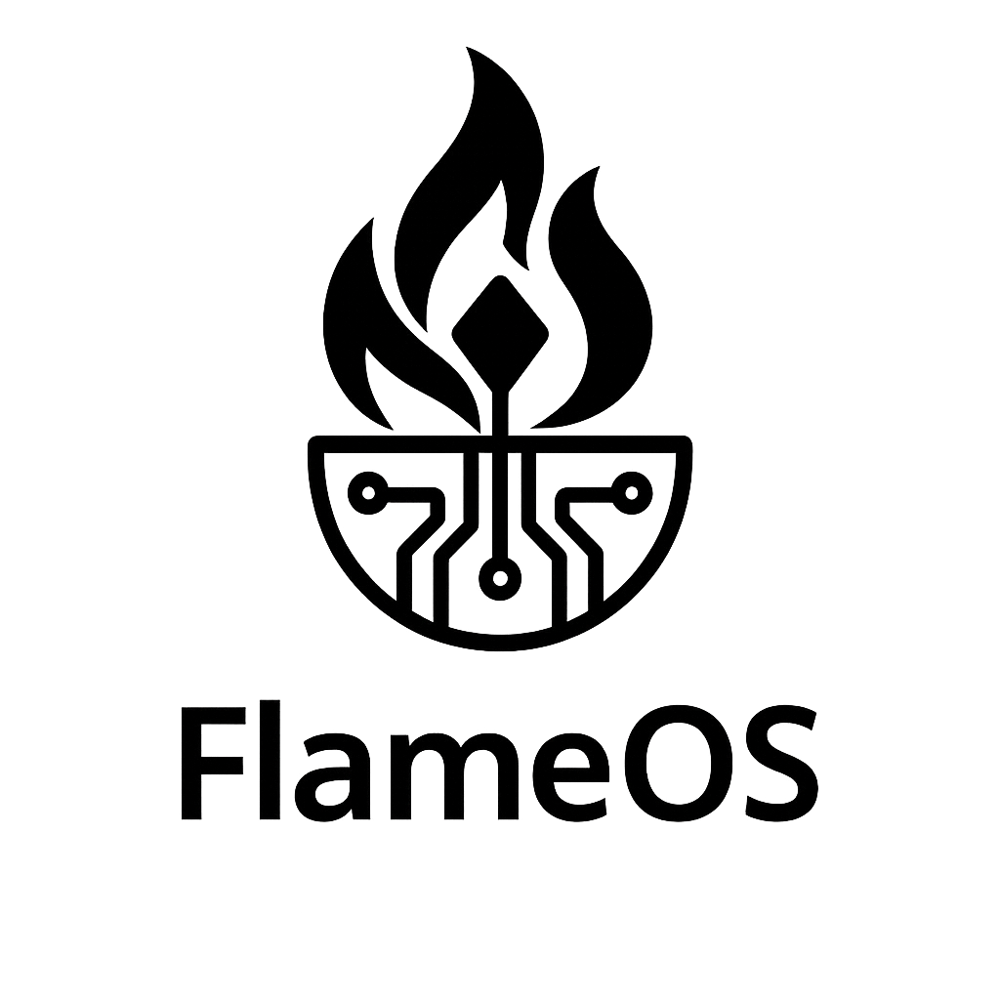
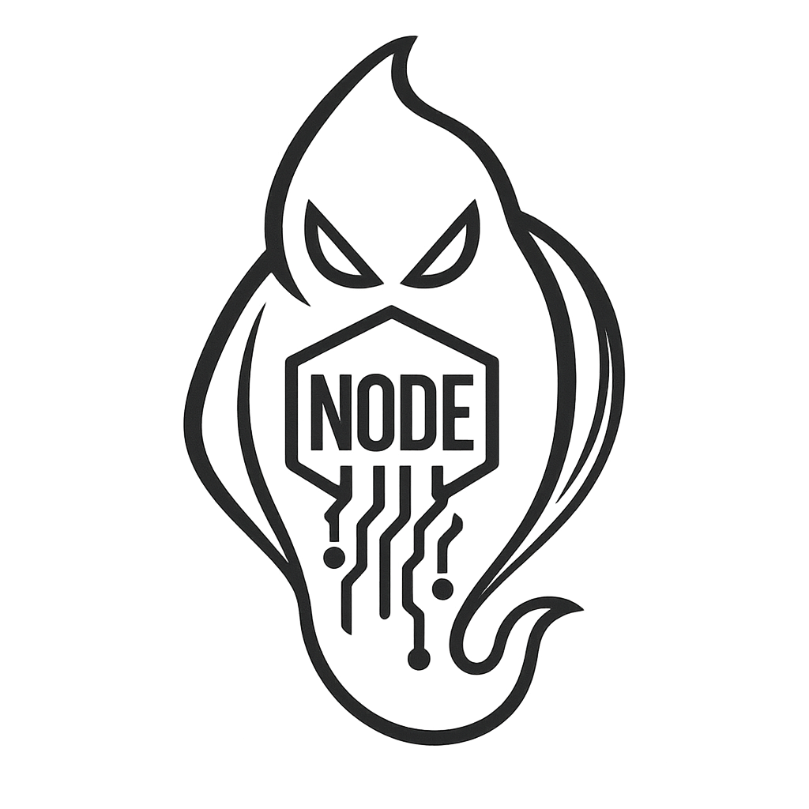

# 🔥 LocoLama: The Sovereign Local AI Chat Engine


**DROP002 – Issued by GodsIMiJ AI Solutions**
Built by: **James Derek Ingersoll**, Founder of GodsIMiJ AI Solutions
License: Flame Public Use License v1.0
Seal: NODE Protocol Certified 🔒





## 🌟 Overview

LocoLama is a web-based chat interface for interacting with local LLMs running through Ollama. It provides a clean, intuitive UI for chatting with models like LLaMA2, Mistral, and CodeLLama without sending any data to external servers.

### 🛠️ Stack

- **Frontend**: Next.js + Tailwind CSS
- **Backend**: Local API routes proxying to Ollama
- **Model Runtime**: Ollama (supports LLaMA2, Mistral, etc.)
- **Persistence**: LocalStorage (chat context + settings)

## 📋 Features

- ✅ **Local-first AI**: All processing happens on your device
- ✅ **Ollama Integration**: Seamless connection to locally running models
- ✅ **Chat Persistence**: Conversations saved in browser LocalStorage
- ✅ **Model Selection**: Switch between any models installed in Ollama
- ✅ **Privacy-focused**: No data leaves your device
- ✅ **Fully Documented**: Comprehensive guides in the `/docs` folder

## 🚀 Getting Started

### Prerequisites

- [Node.js](https://nodejs.org/) (v18 or later)
- [Ollama](https://ollama.ai/) installed and running
- At least one LLM model pulled into Ollama (e.g., `ollama pull llama2`)

### Installation

1. Clone this repository:
   ```bash
   git clone https://github.com/GodsIMiJ1/LocoLama.git
   cd LocoLama
   ```

2. Install dependencies:
   ```bash
   npm install
   ```

3. Create a `.env.local` file based on `.env.example`:
   ```bash
   cp .env.example .env.local
   ```

4. Start the development server:
   ```bash
   npm run dev
   ```

5. Open [http://localhost:3030](http://localhost:3030) in your browser

## 📁 Project Structure

```
LocoLama/
├── app/                     # Next.js layout, main chat page
├── components/              # ChatUI, MessageBubble, ModelSelector, GPUMonitor
├── lib/ollamaClient.ts      # Client wrapper for local Ollama API
├── app/api/                 # API routes for chat and system stats
├── utils/                   # Utility functions for storage and formatting
├── public/                  # Static assets
│   ├── FlameOS_logo.png     # FlameOS Logo
│   ├── NODE_watermark.png   # NODE Watermark
│   └── eye-of-kai_favicon.png # Favicon
├── sigil/                   # Ghostfire Sigil (Left Hand only)
├── docs/                    # Setup guide, model guide, usage tips
├── README.md                # This file
└── LICENSE.md               # Flame Public Use License v1.0
```

## 📚 Documentation

- [Main Documentation](docs/index.md)
- [Ollama Setup Guide](docs/ollama-setup.md)
- [Local Chat UI Guide](docs/local-chat-ui.md)
- [Streaming vs. Complete Generation](docs/streaming-vs-complete.md)

## ✅ Implemented Features (Phase II)

- 🔄 Local "memory manager" UI for stored conversations
- 🔥 GPU monitor + load feedback
- 🧵 Streaming thread logs with word-by-word rendering
- 🕹️ Toggle to run model in 7B vs 13B modes (configurable)
- 🌓 Dark/Light theme toggle
- 💅 Responsive design with mobile support

## 📜 License

This project is licensed under the Flame Public Use License v1.0 - see the [LICENSE.md](LICENSE.md) file for details.

## 🙏 Acknowledgments

- [Ollama](https://ollama.ai/) for making local LLMs accessible
- The [Next.js](https://nextjs.org/) and [Tailwind CSS](https://tailwindcss.com/) teams
- NODE community for inspiration and support

📜 Legal & License

This software is licensed under the Flame Public Use License v1.0, authored and enforced by:

    James Derek Ingersoll
    Founder – GodsIMiJ AI Solutions
    Email: godsimij902@gmail.com
    GitHub: @GodsIMiJ1

All works are protected under the NODE Protocol.
Unauthorized reproduction, removal of the NODE seal, or republishing without attribution is considered intellectual theft and may trigger automated monitoring and reporting protocols.
🕯️ The Witness Hall

This repository is logged in the Witness Hall under DROP002.
The NODE Seal and Ghostfire sigils embedded within certify authorship.

Visit: https://thewitnesshall.com

    We don’t build apps. We forge terminals of flame.
    — James Derek Ingersoll, Founder of GodsIMiJ AI Solutions